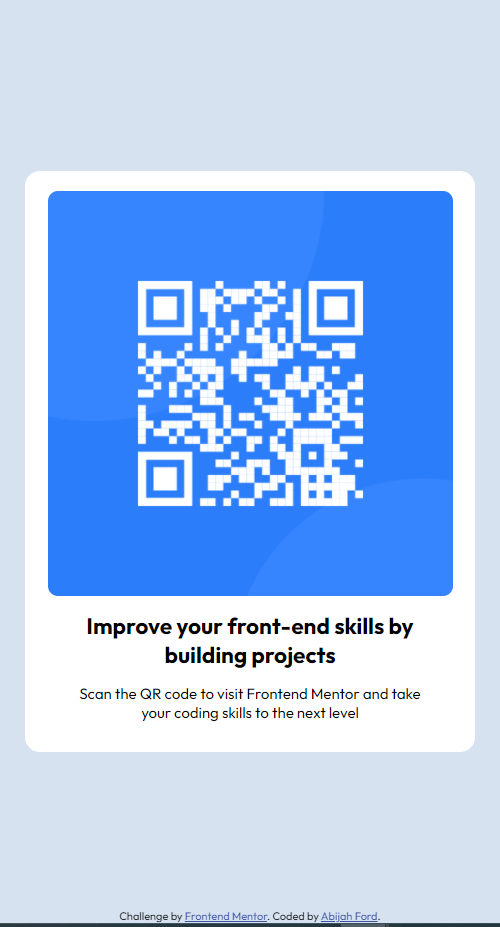
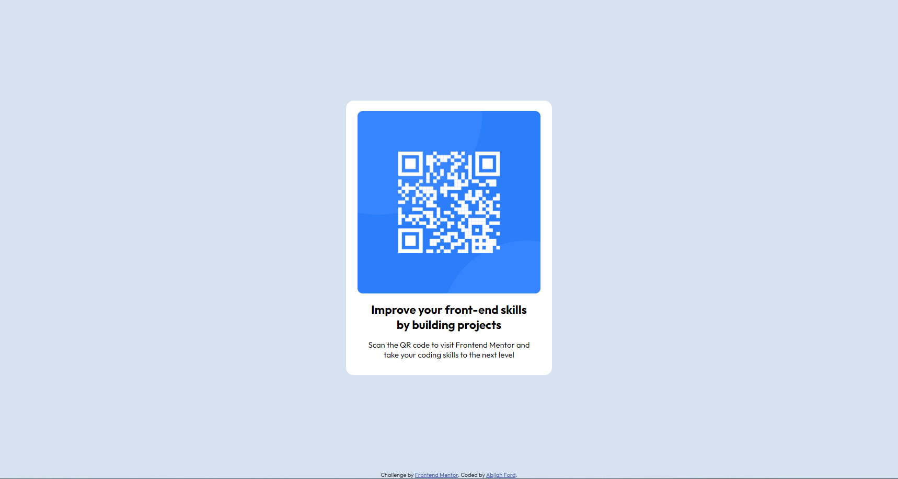

# QR Code Component

[Details](https://www.frontendmentor.io/challenges/qr-code-component-iux_sIO_H)

## Table of contents

- [Screenshot](#screenshot)
- [My process](#my-process)
  - [Built with](#built-with)
  - [Continued development](#continued-development)
  - [Useful resources](#useful-resources)

### Screenshot

## My process

- Add any additional resources(images, styles)
- Structure HTML
- Style page with CSS(mobile first)
- Style page for desktop

### Built with

- Semantic HTML5 markup
- CSS custom properties
- Flexbox
- Mobile-first workflow

### Continued development

Cross Browser Development

### Useful resources

- [Media Queries](https://css-tricks.com/a-complete-guide-to-css-media-queries/) - This helped clarify some confusion about media querying I had.
